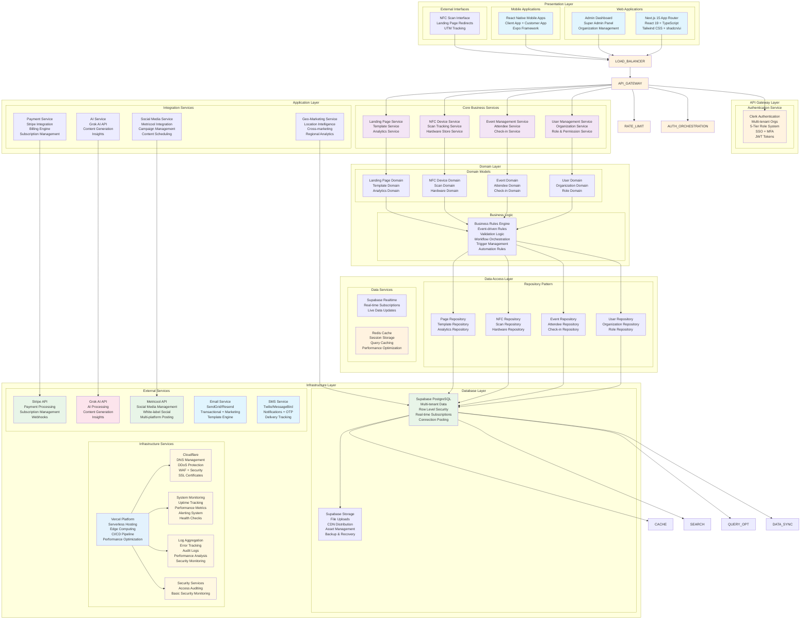
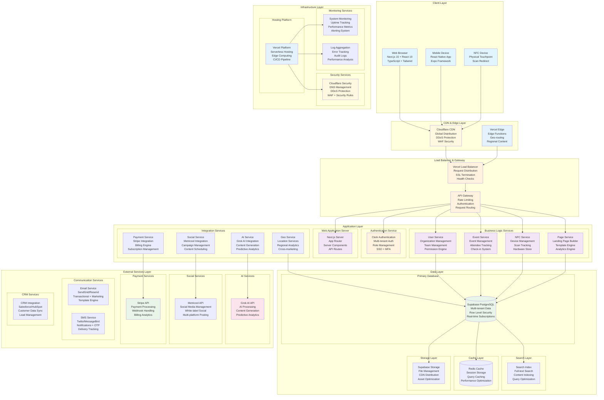
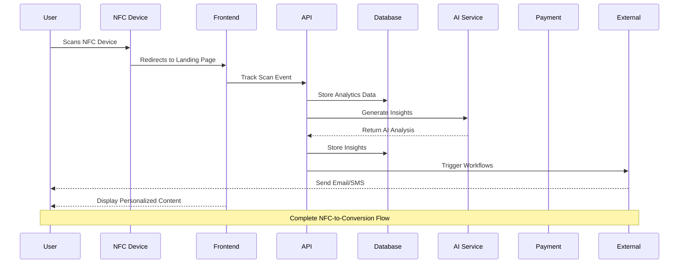
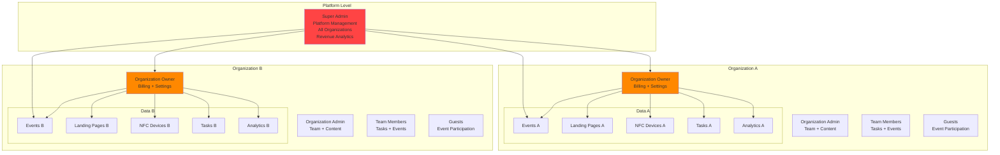
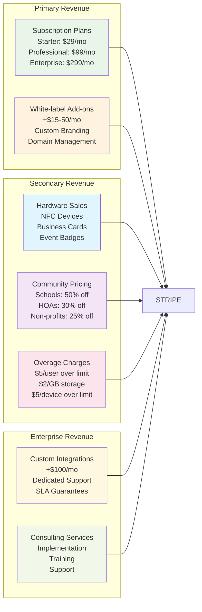
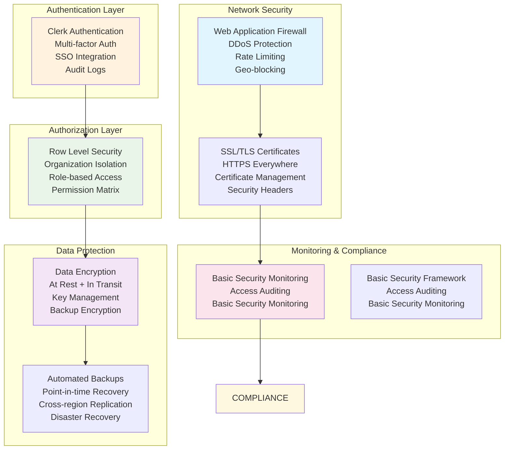

# Cosmic Portals - Layered Architecture

## Layered Architecture Overview

## Layered Architecture Explanation

### **Load Balancer & Gateway Layer**

- **Load Balancer**: Vercel Load Balancer with SSL termination, health checks, geo-routing
- **API Gateway**: Request routing, rate limiting, authentication, geo-routing

### **Presentation Layer**

- **Web Applications**: Next.js 15 with React 19, TypeScript, Tailwind CSS
- **Mobile Applications**: React Native with Expo framework
- **External Interfaces**: NFC scan redirects, landing page interfaces

### **API Gateway Layer**

- **Authentication Service**: Clerk for multi-tenant authentication and role management
- **Security Services**: Rate limiting, request throttling, API quotas, DDoS protection

### **Application Layer**

- **Core Business Services**: User, Event, NFC, and Landing Page services
- **Integration Services**: Payment, Social, AI, and Geolocation services

### **Domain Layer**

- **Domain Models**: Business entities and their relationships
- **Business Logic**: Rules engine, validation, and workflow management

#### **Business Rules Engine - Detailed Components**

**Event-Driven Rules System**

- **NFC Scan Rules**: Auto-trigger workflows on device scans
- **Event Check-in Rules**: Automated attendee processing and notifications
- **Payment Rules**: Subscription limits, overage calculations, billing triggers
- **User Role Rules**: Permission validation, access control enforcement
- **Geo-location Rules**: Regional content delivery, cross-marketing triggers

**Validation Logic Engine**

- **Data Validation**: Input sanitization, format validation, business rule compliance
- **Permission Validation**: Role-based access control, organization boundaries
- **Plan Limit Validation**: Subscription tier enforcement, usage monitoring
- **Event Validation**: Capacity limits, date/time constraints, attendee limits
- **NFC Device Validation**: Device registration, scan authenticity, hardware limits

**Workflow Orchestration**

- **User Onboarding**: Multi-step organization setup, team invitation flows
- **Event Management**: Creation → Setup → Launch → Analytics workflow
- **NFC Campaign**: Device registration → Landing page linking → Analytics tracking
- **Payment Processing**: Subscription → Billing → Usage tracking → Overage alerts
- **Content Publishing**: Draft → Review → Approval → Publish → Analytics

**Trigger Management System**

- **Time-based Triggers**: Scheduled social posts, recurring billing, event reminders
- **Event-based Triggers**: NFC scans, check-ins, payments, user actions
- **Condition-based Triggers**: Plan upgrades, usage thresholds, error conditions
- **External Triggers**: Webhook events, API calls, third-party integrations

**Automation Rules Engine**

- **Email Automation**: Welcome sequences, event notifications, billing alerts
- **SMS Automation**: OTP delivery, event reminders, emergency notifications
- **Social Media Automation**: Content scheduling, cross-platform posting, engagement tracking
- **Analytics Automation**: Report generation, insight delivery, performance alerts
- **Integration Automation**: CRM sync, payment processing, data synchronization

### **Data Access Layer**

- **Repository Pattern**: Data access abstraction for each domain
- **Data Services**: Caching, search, query optimization, synchronization, backup & recovery

### **Infrastructure Layer**

- **Database Layer**: Supabase PostgreSQL with RLS and real-time subscriptions
- **External Services**: Stripe, Grok AI, Metricool, CRM, Email, SMS
- **Infrastructure Services**: Vercel hosting, Cloudflare security, monitoring, logging

### **Security & Compliance Layer**

- **Authentication**: Multi-factor auth, SSO integration, audit logs
- **Authorization**: Row Level Security, role-based access, permission matrix
- **Data Protection**: Encryption at rest + in transit, key management, backup encryption
- **Basic Security**: Access auditing, basic security monitoring
- **Audit & Monitoring**: Activity tracking, access auditing, compliance reports

## Technical Architecture Diagram

## Data Flow Architecture

## Multi-Tenant Data Architecture

## Revenue Streams Architecture

## Security & Compliance Architecture

## Technology Stack Summary

### Core Platform

- **Frontend**: Next.js 15, React 19, TypeScript, Tailwind CSS
- **Backend**: Next.js API Routes, Supabase, Vercel Edge Functions
- **Database**: Supabase PostgreSQL with RLS
- **Authentication**: Clerk (multi-tenant, roles, SSO)
- **Payments**: Stripe (subscriptions, billing, webhooks)

### AI & Analytics

- **AI**: Grok AI (insights, content, predictions)
- **Social Media**: Metricool (white-label social management, multi-platform posting)
- **Analytics**: Built-in analytics engine (event tracking, UTM campaigns, conversion funnels)
- **Monitoring**: System monitoring (uptime, performance, alerting)

### Infrastructure

- **Hosting**: Vercel (CDN, edge computing, CI/CD)
- **Security**: Cloudflare (DNS, DDoS, WAF, security)
- **Storage**: Supabase Storage (files, CDN distribution)

### Mobile & External

- **Mobile**: React Native with Expo (Client App + Customer App)
- **Hardware Store**: NFC devices, business cards, event badges
- **Integrations**: Email, SMS services
- **White-label**: Custom domains, branding, themes
- **Geo-Marketing**: Location intelligence, cross-marketing, regional analytics

### Monitoring & Observability

- **System**: Custom monitoring (uptime, metrics, alerts)
- **Performance**: Vercel analytics and monitoring

This architecture supports the full Cosmic Portals platform with all features, revenue streams, and scalability requirements.
