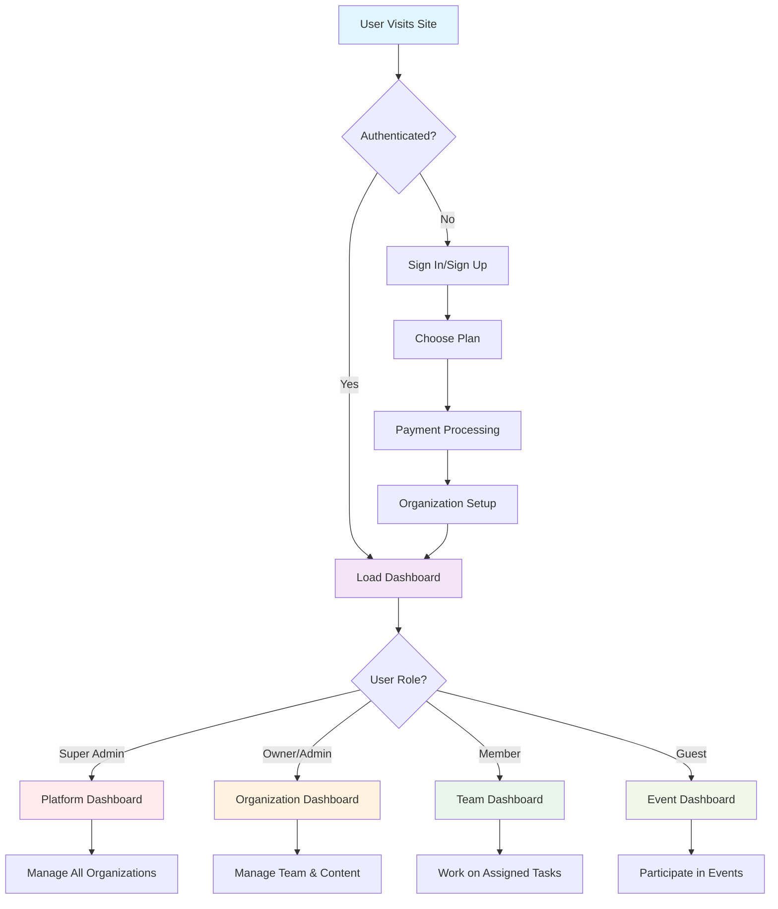
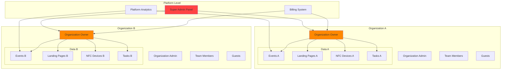
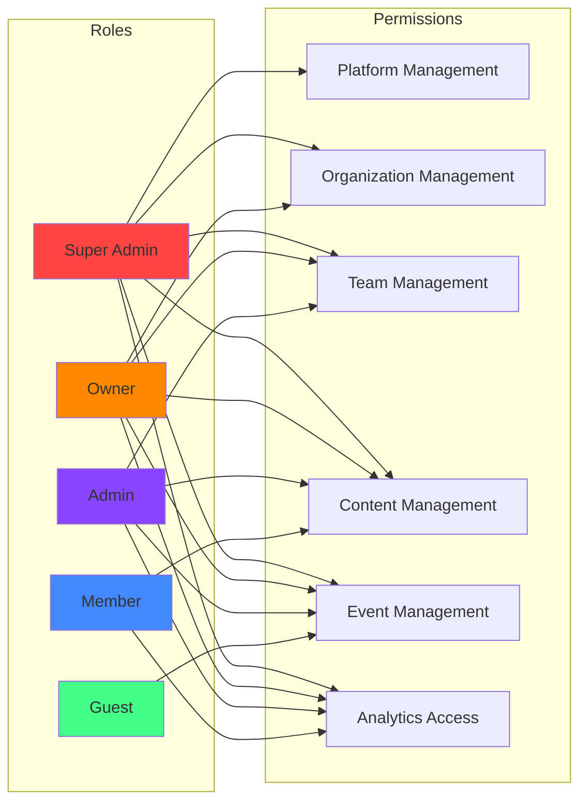
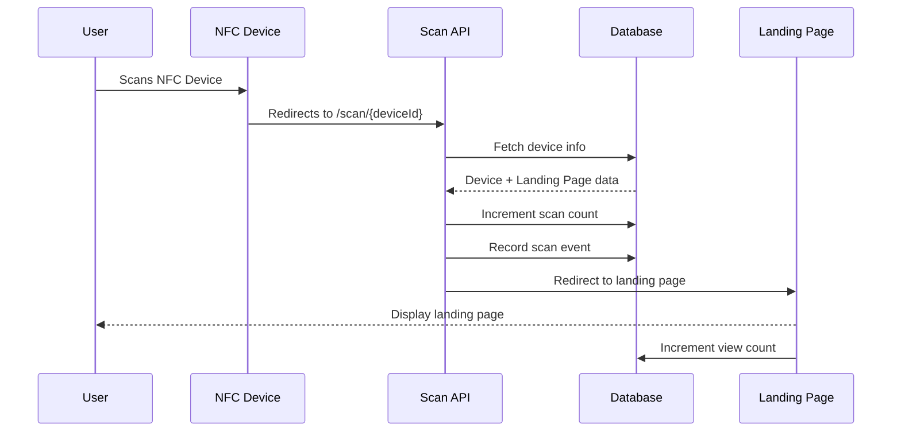
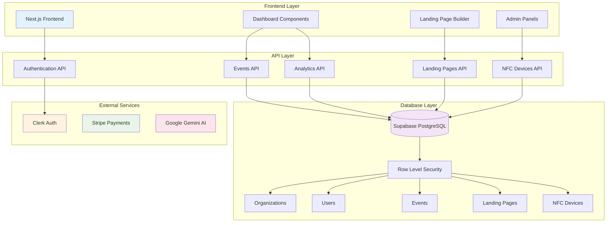
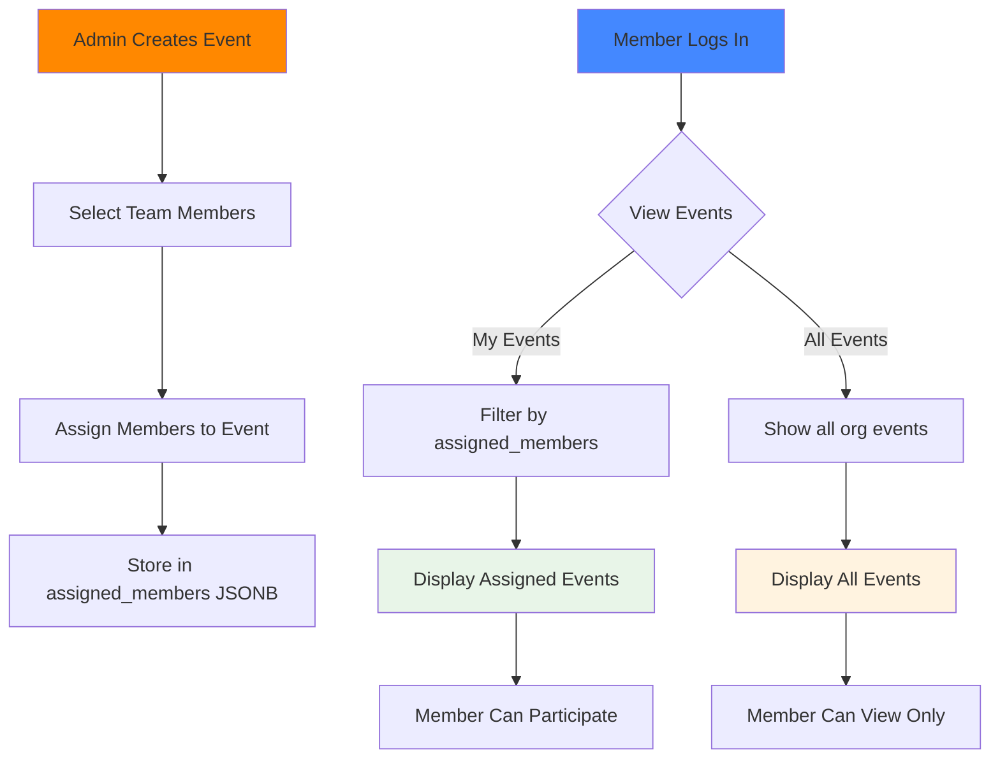
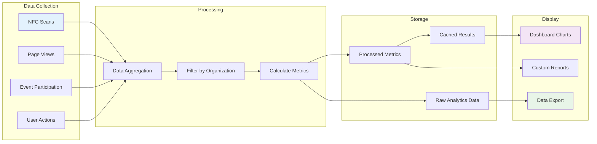

# 🏗️ COSMIC PORTALS - System Architecture

## 📊 **User Role Hierarchy**

```mermaid
graph TD
    A[Super Admin] --> B[Platform Management]
    A --> C[All Organizations]
    A --> D[Billing & Payments]
    A --> E[System Settings]
    
    F[Organization Owner] --> G[Organization Settings]
    F --> H[Team Management]
    F --> I[Billing Management]
    F --> J[Content Management]
    
    K[Organization Admin] --> L[Team Management]
    K --> M[Event Management]
    K --> N[Landing Pages]
    K --> O[NFC Devices]
    
    P[Team Member] --> Q[Assigned Events]
    P --> R[Landing Pages]
    P --> S[Task Management]
    P --> T[Personal Analytics]
    
    U[Guest] --> V[Event Participation]
    U --> W[RSVP System]
    U --> X[Photo Gallery]
    
    style A fill:#ff4444
    style F fill:#ff8800
    style K fill:#8844ff
    style P fill:#4488ff
    style U fill:#44ff88
```

## 🔄 **User Journey Flow**

## 🏢 **Multi-Tenant Architecture**

## 🔐 **Permission Matrix**

## 🎯 **NFC Device Flow**

## 📊 **Data Flow Architecture**

## 🔄 **Event Assignment System Flow**

## 📈 **Analytics Data Flow**

---

*This architecture supports the multi-tenant SaaS model with proper data isolation, role-based access control, and scalable analytics.*
